# Corne Build Guide

In this article I'll try to explain how to create wireless, mechanical, split, ortholinear keyboard corne.

## Why do we need split keyboards?

On the standard keyboard your wrist and foreams are twisted, so your hand are tilted, this may leads to stress on your tendons and muscles. But split keyboards has much more clever shape, so they may solve these problems.

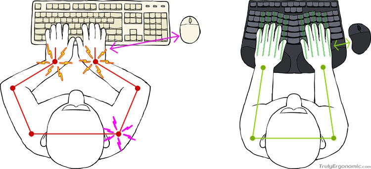

## Why do we need ortholinearity?

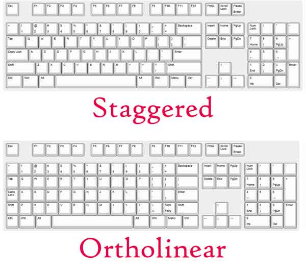

To answer on this question we need to at the old mechanical typewriters. Because each key was connected to a bar that physically struck the paper. In order to fit multiple rows of keys, the keys were staggered in between each other.

Novadays it's absolutely pointless, because physical bars were replaced with electrical signals. But we still use this layout. It is also always inconvenient, because we always have to do micro-movements to constantly move our wrist. But with an ortholinear keyboard, your wrist is always in the same position. 

## Why corne?

I used Ergodox, Ergo42, and last six months I used IRIS keyboard. When I just started using the split keyboard I typed really slow, I spent about two weeks to type at normal speed, but after some time, I understand that my hands always in the same position to the keyboard. 

Also, you can always place the keyboard at a convenient angle. For example, I am sitting on a chair and on the armrests I have two halves of the keyboard. And this is much more convenient than if I kept one large one on my feet. 

Also, all the most frequently used keys are under the thumb. If you use Windows and Mac, you probably, noticed that in Windows you usually use CTRL with all the hotkeys (ctrl + c, ctrl + v, ctrl + s) and you always have to press it with your little finger. In macOS, the main button is CMD, and the same keyboard shortcuts you press with your thumb, not your pinky. And it's much, MUCH more convenient. It is natural for the thumb to bend in different positions in relation to how our hands are lying. The little finger is much simpler, it does not have so many tendons. 

I worked 6 months with IRIS and I realized that I no longer want to go back to standard keyboards. Sometimes I use them, for example, I have a regular keyboard at the computer where I play games. 

And right now I realized that I want to move my hand even less. I want the numbers to be in the layer too. 

But if you never used split keyboards, probably you should start with something more standard, like Ergodox or Moonlander.

## Why is everyone afraid of layers? 

Usually people are very afraid of layers. They do not understand how to work with a keyboard without numbers. People who are very far from IT get scared of even 65 percent keyboards. They get worried when they don't see the Insert or F keys. 

They don't realize that they use layers all the time and have absolutely no problem with it. 

A lot of people use two languages on their keyboards. For example English and Russian. So, what should you do to get "№" symbol. It's russian equivalent to "#". You use layers. 

And not even one layer. You took it from two layers. To get this sign, you first have to be in the layer with the Russian layout, and then go to the second layer using the shift key and press "3". And if you were in the English keyboard, you would get "#".

How do you deal with all these layers? 

If you don't like layers, then you have to be consistent and find yourself a keyboard where! "#;%:? * (_ +) Removed from the layer. It will look like this, btw:

Much better. But let's also remove the layer from the F keys. Otherwise, you can get confused in these layers. 

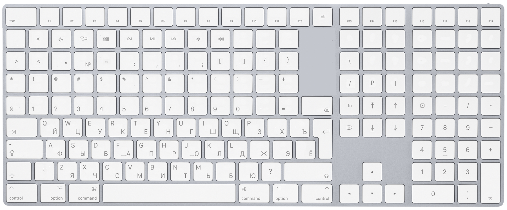

Wait, we still have a layer with different letters. How can letters be stuffed into layers? Are you out of your mind? Let's take them out of the layer. We don't like layers. 

We got rid of the layers. But wait, we still have a layer. We have big letters in the layer under the shift. And if we don't like layers, then we have to move the large letters separately. 

## No need to be afraid of layers 

So, you don't need to be afraid of layers, the convenience that you get from the fact that the hand is always in one position exceeds the convenience of having a separate row for numbers. 

In a week you get used to the fact that all the numbers are in a layer. And all the symbols are not on the same layer, via Shift, but just below the numbers. That is, you do not need to press the same button plus Shift in order to type some symbol. 

## A few words about Corne

Corne is made by foostan. It was based on Helix, which is not as popular as corne right now. The author does not sell anything, he developed everything and put it in the public. You can buy it on many different sites. Choose any.

Also, there is a fork called "Jorne" made by Joric for someone who want to place all the Russian letters on the keyboard. This keyboard has one additional button on the left and right.

This keyboard is not sold ready-made. But some services may asseble it for you for additional price. But usually you will get two boards, diodes, LEDs, hotswaps. This will need to be soldered and assembled. In addition to this kit, you will also need two microcontrollers, 42 switches, 42 keycaps, a TRRS cable (if you want wired version) and a cable to connect to pc.

## Layout 

My layout at this moment looks like this, if you need it, you can download it in my github

wireless (zmk) - https://github.com/devpew/zmk-config

wired (qmk) - https://github.com/devpew/corne-keyboard-layout

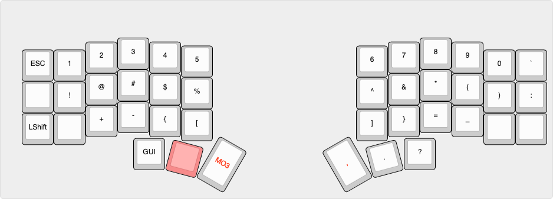

Buttons with black labels works on a tap. Buttons with red labels will work on hold. Buttons with red background change layouts.

I have two main layers - a layer with numbers and a layer with navigation. 

If you suddenly think that this is too complex, there are many layers and few keys, you can check this layout https://github.com/manna-harbour/miryoku it's totally crazy.

In this layout GUI, CTRL, ALT, SHIFT under ASDF and JKL: buttons.

In this layout you do not have to move your arm as intensively as you always do. If you need to enter a large button from the right half of the keyboard, then on the left you hold down "F" and press the button. If you need to press the big one in the left half, then press the "J" on the right. 

## Price

The minimum price for the corne is $127.

$ 32 - Price for two boards of version 3.0.1 withh diodes, hot swaps, LEDs.

$ 18 - A pair of Pro Micro microcontrollers

$ 25 - FR4 case

$ 10 - Cables

$ 28 - Switches

$ 14 - Keycaps

# Build

I already tried to build corne, but I messed up everything becauce of couple things.

### Bad soldering iron and flux

My first mistake was in my soldering skills. I didn’t know how to solder at all. I also had to buy a normal soldering iron. Before that, I had a giant Soviet soldering iron.

Now I bought a nice soldering station, it's much easier to work with it. By the way, I also advise you to buy a normal flux. I had some kind of dark brown flux, right now I understand that it was terrible. 

I highly recommend to buy some modern flux and soldering iron. 

### Bad case

I bought an acrylic case. I really hate acrylic, it's always bad choise. Acrylic always creaks, luft and it is always unpleasant to use it.

Also, switches do not hold in this case at all. And the problem is not in the switches, since both mx and choc do not hold. You just flip the keyboard and everything falls out.

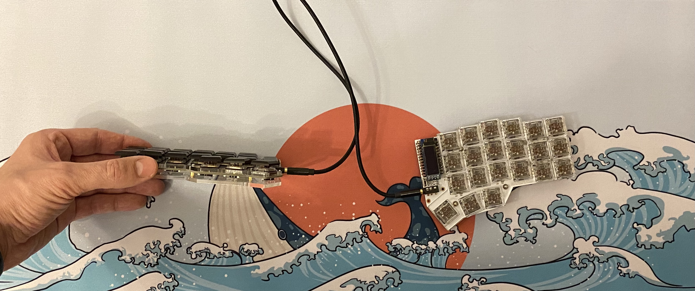

### Second bad case

After that, I bought another case. And it is also completely unsuitable for Corne with Choc switches. This case is called "Corne Engineer Keyboard Case".

First, it came with a crack in the middle layer, even though the package itself was well packed. I wrote in support of the store and this middle part was sent to me separately, but another month has passed.

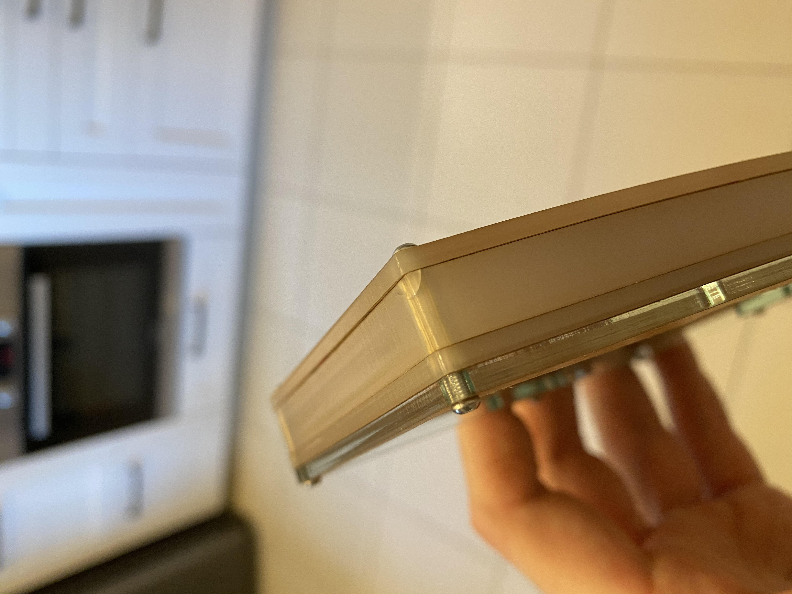

The second problem is that this case has a side around the buttons. And if you use MX switches, then everything will be fine. But it is impossible to press low choc with your thumb, since it clings to this side. The buttons in this case are very much recessed.

By the way, this case is really poorly designed. It seems that the person who designed it never used it. Since here the charging socket is made in the wrong place. And the cable just won't fit through the cable hole. 

I do not recommend this case at all.

Although the backlit looks good in it, I don't recommend to buy this case.

### Switches

I assembled two keyboards, the first one with low-profile Kailh Choc switches, and the second one with usual mx switches Zealios v2 from Zeal PC.

Switches from Zeal PC much better in typing, but choc switches thin like notebook's switches. Personally, I'm not a fan of thin laptop keyboards, so I don't understand the beauty of these switches. I will definitely stay with Zealios v2.

## What do you need to buy 

If you want to build corne you have two options: buy some kit with all the components or order everything by yourself. If you prefer second option you need to order the plates on some service that could print PCB (for example https://jlcpcb.com/order)

And also you need to buy these components:

| Sockets                                        |                                                              |
| ---------------------------------------------- | ------------------------------------------------------------ |
| Reset Button (need 2)                          | [https://s.click.aliexpress.com/e/_98s0pI](https://s.click.aliexpress.com/e/_98s0pI) or https://s.click.aliexpress.com/e/_Ae76Wo |
| Pro Micro (Need 2)                             | [https://www.aliexpress.com/item/32849563958.html](https://www.aliexpress.com/item/32849563958.html) |
| Display (Optional. Need 2)                     | [https://aliexpress.ru/item/32798439084.html](https://aliexpress.ru/item/32798439084.html) |
| Sockets (square)                               | [https://aliexpress.ru/item/622209657.html](https://aliexpress.ru/item/622209657.html) |
| Sockets (rounded)                              | https://s.click.aliexpress.com/e/_98s0pI                     |
| Pins for rounded sockets                       | https://s.click.aliexpress.com/e/_ATiGO0                     |
| Kailh Hot Swap Sockets (need 42)               | https://s.click.aliexpress.com/e/_Arnkja                     |
| Kailh low profile Switch (need 42)             | https://s.click.aliexpress.com/e/_9JyNiU                     |
| Kailh low profile Keycaps (need 42)            | https://s.click.aliexpress.com/e/_9IS4DW                     |
| TSSR connector (need 2 for wired)              | https://s.click.aliexpress.com/e/_ATavWy                     |
| SMD Diodes (need 42) You should buy 1N4148W T4 | https://s.click.aliexpress.com/e/_A3O8Dq or https://s.click.aliexpress.com/e/_A9ugRS or https://s.click.aliexpress.com/e/_ALEzpi |
| Standoff Screw Spacer (need 10)                | https://s.click.aliexpress.com/e/_AmT8DQ                     |
| Socket Head Cap Screws (need 10)               | https://s.click.aliexpress.com/e/_99WIwo                     |
| TRRS Cable                                     | https://s.click.aliexpress.com/e/_A26gtI                     |

LED (Optional):

| SK6812 Mini 3535 (for v.2.0 or v.2.1, need 54) | https://s.click.aliexpress.com/e/_A5Dy4G           |
| ---------------------------------------------- | -------------------------------------------------- |
| SK6812 Mini 5050 (for v.3.0.1, need 12)        | https://s.click.aliexpress.com/e/_A5Dy4G           |
| SK6812 MINI-E (for v.3.0.1 need 42)            | https://www.aliexpress.com/item/4000475685852.html |

Also, useful things:

| Soldering station                              | https://s.click.aliexpress.com/e/_AfojQk                     |
| ---------------------------------------------- | ------------------------------------------------------------ |
| Soldering Iron Tips Repalcement Soldering Bits | https://s.click.aliexpress.com/e/_AkvAW0                     |
| Transparent Flux                               | https://s.click.aliexpress.com/e/_9QBaRi                     |
| Stem holder                                    | https://s.click.aliexpress.com/e/_Ad086s                     |
| Lube for switches                              | https://s.click.aliexpress.com/e/_ADpCDO                     |
| SA Keycaps                                     | https://s.click.aliexpress.com/e/_AcDx9w                     |
| 110mA battery                                  | https://aliexpress.ru/item/4000336502739.html                |
| Zealios V2                                     | https://s.click.aliexpress.com/e/_A48mfw                     |
| XIAOMI Mijia Wowstick                          | [https://s.click.aliexpress.com/e/_9i4jEB](https://s.click.aliexpress.com/e/_9i4jEB) |
| Magnetic Screwpad                              | https://s.click.aliexpress.com/e/_A6N17v                     |
| Filmings                                       | https://s.click.aliexpress.com/e/_9RiYF5                     |
| Keycap Remover                                 | https://s.click.aliexpress.com/e/_ABFr9V                     |
| Swithces Remover                               | https://s.click.aliexpress.com/e/_AT4cuP                     |
| Switch Opener                                  | https://s.click.aliexpress.com/e/_AOCn99                     |
| Nice cover                                     | https://s.click.aliexpress.com/e/_9HZo4P                     |
|                                                |                                                              |

### Sockets

Joric made a really nice article about sockets - https://github.com/joric/nrfmicro/wiki/Sockets

I recommend not to sold the controller right into the board, but to sold the sockets into the board, and sold pins to the controlles. In this case you will be albe to change the controller in the future.

For example, you will want to make your keyboard wireless. You don't need to sold anything, you just need to take out your controller and install another one with BLE chip. The same applies to the screen, do not sold it, but put with the sockets.

I saw three types of sockets. The most common ones are sold in any store. But they are too high.

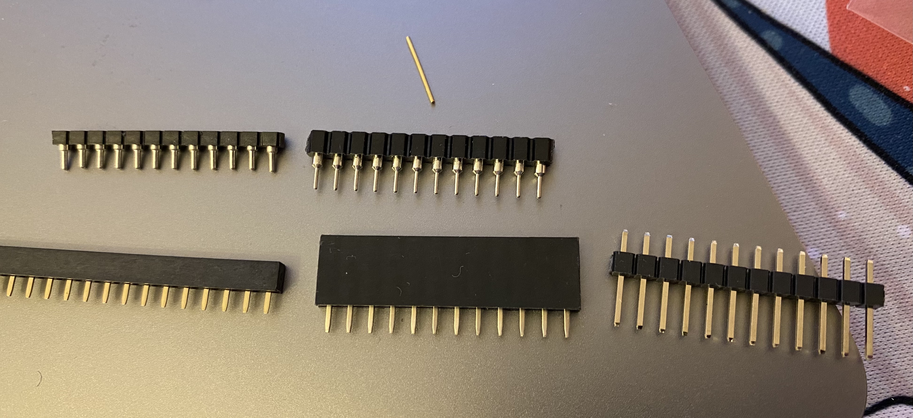

These sockets looks good, and also you may use 110mAh battery with them, right under the controller. 

rounded sockets - https://www.aliexpress.com/item/32892386779.htm or https://www.aliexpress.com/item/32847384633.html

squared sockets - https://aliexpress.ru/item/622209657.html

pins for rounded sockets - https://s.click.aliexpress.com/e/_AKfdZK

Also, there are sockets even lower, they are called "Mill Max Low Profile Sockets" they are sold in some stores, they are very thin, they come with pins. The problem is that, firstly, it is rather difficult to find PINs separately. Secondly, they are quite expensive, a set of sockets with legs costs about seven dollars.

### Hotswap

I recommend to buy the version 3.0.1 with Hotswap, in general in 2021, all keyboards should be with hotswap. In the future the switches will need to be serviced. Or you may want to try other switches.

### Controller

If you want to build a wired version, then you have two options - ProMicro and Elite-C v4. I don't know what technical differences are there, but for us, for users, the difference is that the first with micro usb, the second with type c. You need two controllers. By the way, you can buy one ProMicro and one Elite-C v4 to save some money and they can work well together.

ProMicro - [https://www.aliexpress.com/item/32849563958.html](

If you want to build a wireless one, then there are two options - nice!nano, which has not been on sale for three months now, and nfrmicro1.4

### Case

There are many options - Acrylic case, FR4 case, Steel case, Aluminum case, 3D Printed case

#### Acrylic case

I do not recommend to buy the acrylic case, since the switches do not hold in it. It just falls out of him. Also, it is easy to scratch.

I don't recommend a case called "Corne Engineer Keyboard Case" either. It looks extremely poor. Low profile switches do not fit there, since you simply cannot press them at the edges.

#### 3D Printed case

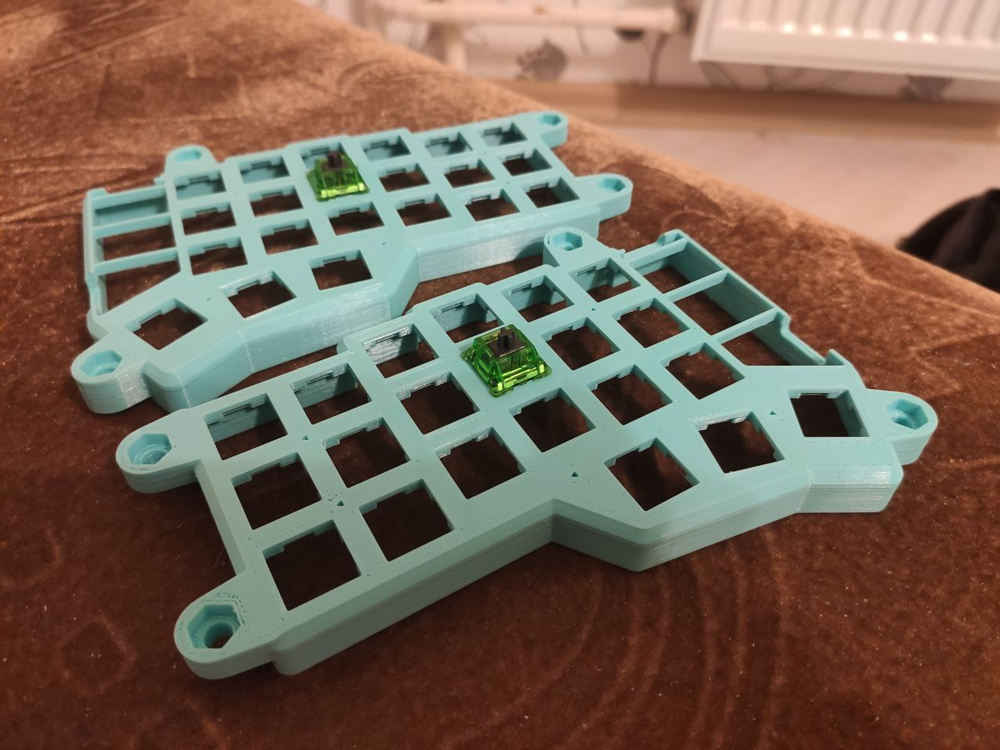

Never used 3d printed cases. If you know how to get it, please ping me.

#### Steel case

I never used steel case for corne, but i used a lot steel case for Iris keyboard. And I really like it. it's really hard to scratch it. It's always cold. I really like that my keyboard is heavy in this case.

And it looks really nice.

What I don't like it steel cases is that you always need to be sure of the distance to the board. 

#### Aluminum case

Aluminum is similar to steel, but lightweight. It is very expensive, because of such a high price I cannot recommend it. 

Its second disadvantage is handprints on it, on steel it is almost imperceptible. And these traces are quite difficult to remove, since the aluminum itself is a little "rough". In addition, again, aluminum is not a dielectric and you need to leave a gap between the case and the board and because of this the height of the keyboard will be higher than in the FR4 case. 

#### FR4 case

FR4 is the kind of material that PCBs are made of. And initially it seemed to me that this was not a case at all, but just some kind of temporary solution that can only be used until you find a some nice case. But it's a really nice option. 

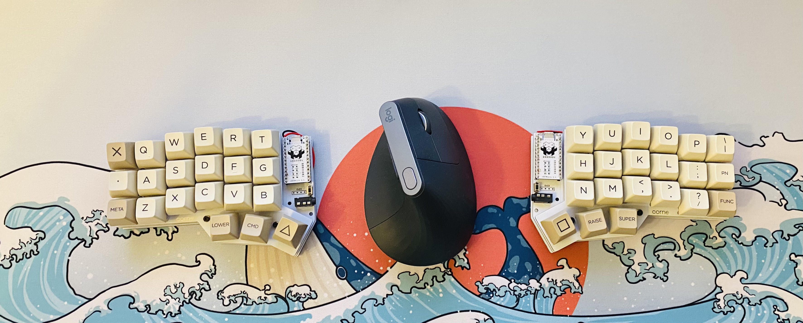

It doesn't look bad, but it also costs a penny. FR4 lacks those awful sounds like acrylic cases. In general, a fairly cheap and practical option. But, perhaps, from the aesthetic point of view, not everyone likes it. I also like the fact that you can press it as close to the board. 

#### IMK

There is also a case that I have not tried, but I really want to. If you suddenly know where you can find it, then contact me please. This case is called IMK and has been out of stock for several months. The top of this case is metallic, the bottom has a transparent part from Frosted Acrylic. It looks more interesting than any other case. 

### Corne Switch Plate Foam

Some people prefer to use some foam to isolate unnecessary sounds, since sometimes there are extraneous vibrating sounds from the case.

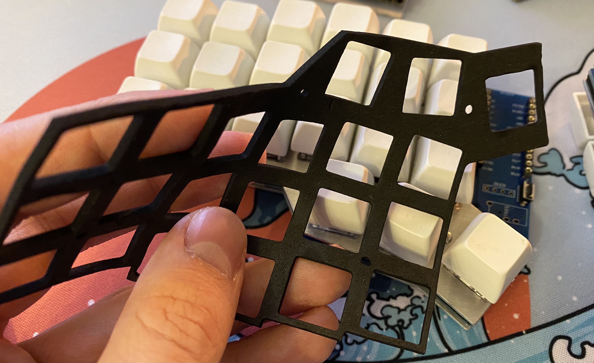

For Corne, you can also buy such a foam made of soft material, which is installed between the PCB and the plate. In the case of Corne, this is a pretty useless thing. In fact, after installing it, nothing changes. But if you feel some sounds, you can try it. 

### Plates

#### Corne Plate Types

There are three options 

* Version 2.0 without hotswap, called "Corne Classic PCB Kit". Cheapest option, it costs only $19 on different stores. I recommend it only to those who know for sure that they will sold their switches. In addition, I did not like that there are ordinary diodes, and not SMDs, it takes longer to sold them. Usually, there are no LEDs in the kit, and the LEDs themselves are not very successful, in the next versions of corne there are another LEDs, with different legs, which are much more convenient to sold. 
  

* Second version is 2.1 "Corne Choc Hotswap PCB kit" or "Corne MX Hotswap PCB Kit". Not a bad option, it costs $24. If you want a thin keyboard with hotswap, this is your only option. But if you want to use normal switches, then I recommend the third option. 
  

* The third option costs $ 36. This is the latest version 3.0.1 at the moment, only MX switches and hot swaps are supported here. I recommend buying it. The kit will already include diodes, hot swaps, LEDs, reset buttons and a TRRS connector. This version has another version of LEDs, which are much easier to sold and the board itself has become one-sided. 

  

#### Where to buy plates

If you want to buy corne plates there are two options: buy a kit on a different stores or order plates on some PCB manufacturer, for example https://jlcpcb.com

But on these services you can't order just one plate. For example, on jlcpcb the 5pc is minimal amout.

For example, 5pcb of corne 3.0.1 and top and bottom case costs me $51.3 and $22.9 for shipping.  

5pcb of jorne will be about the same

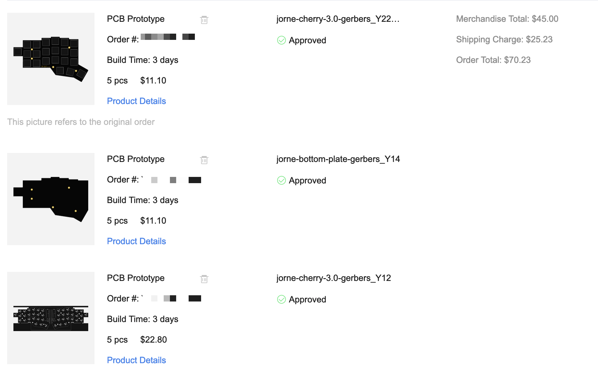

5pcb of jiran will be the same too

But 5pcb of Sofie will be much cheaper, just $35.7 without shipping

## Assembly

### Sold sockets

You need to sold sockets to the plate. 

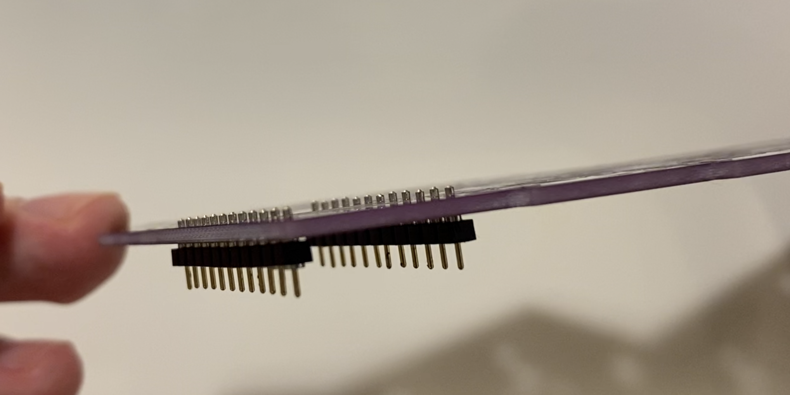

You may put it and after that, you can secure it all with tape so that it does not move when you solder it. Turn over and gently sold it.

After that put your controller to the pins and sold it

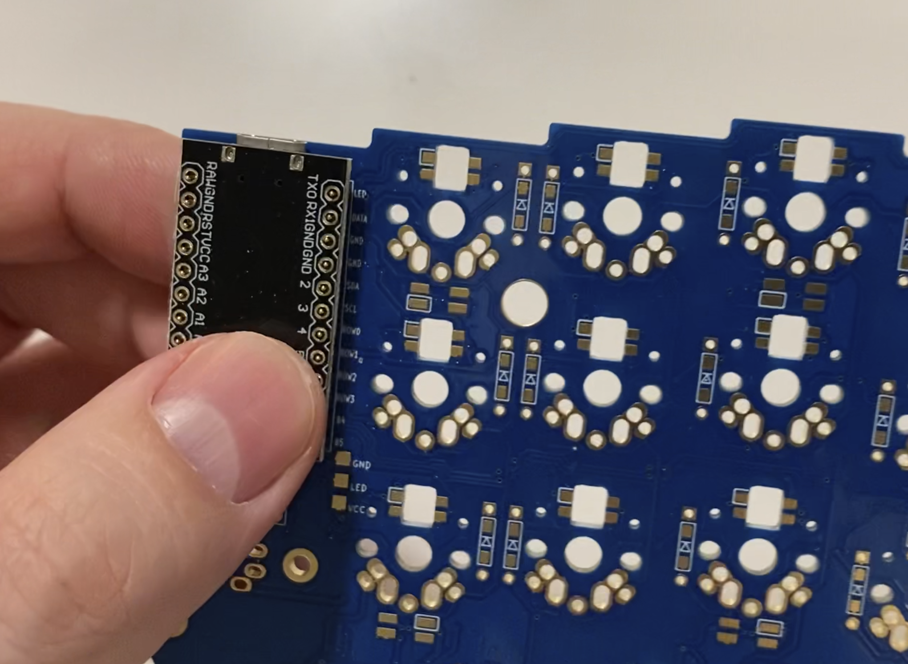

You will get something like that

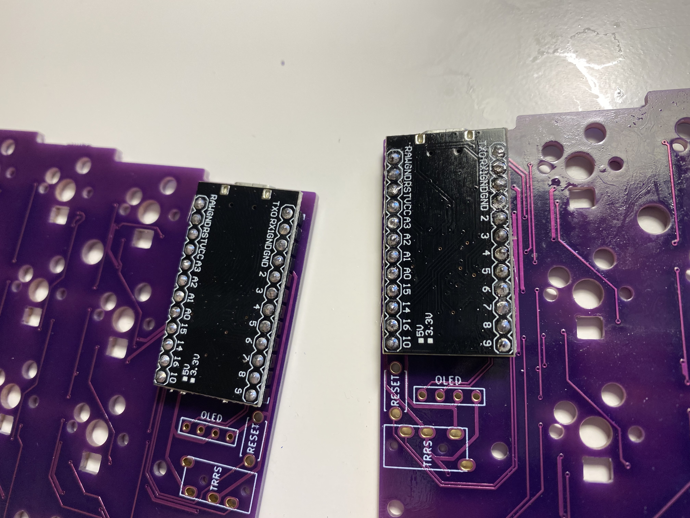

Be careful, try to use less solder to avoid shorting the contacts.

### Sold diodes

In the first version of corne the are two versions of diodes. Standard and SMD. It's really easy to sold both. But you need to cut standard. I like to use SMD much more.

When you start to sold them you need to place it by the correct side. This little triangle should looks on the black part of the diode. 

In the latest version of the board, you can only solder diodes from the bottom. But in the second version, you can place them on top or bottom. If you use low-profile choc switches, then they must be soldered from the bottom, if soldered from the top, then you can't install the switches.

### Sold backlight

> If you plan to use your keyboard without wires I highly not recommend to sold LEDs, because they drain a lot of battery.

LEDs are the most difficult to solder, as I said before, I recommend to buy nice soldering iron with a thin tip, a flux pencil. Initially, when I had a soldering iron with a thick sting and dark smelly rosin, I got something like this horror. 

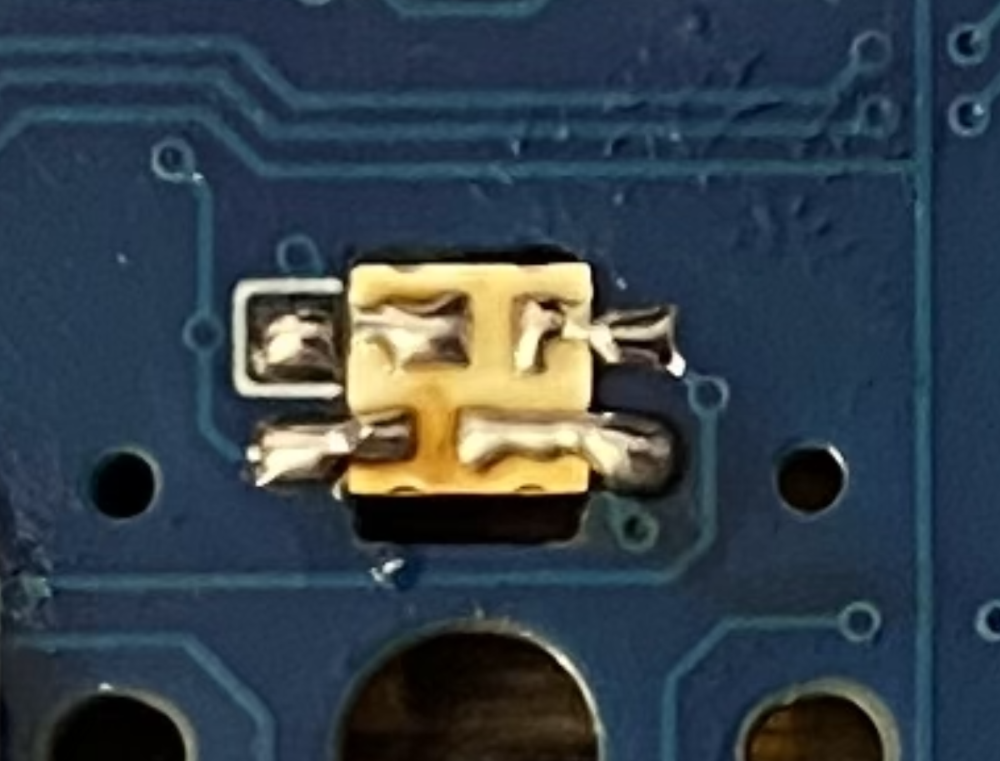

The first and second version of the keyboard use SK6812MINI LEDs, I think this is a bad choice. They has all the contacts on the back side. Because of this, it is very easy to burn them, when soldering and also because of this it is difficult to sold them to the plate.

SK6812 Mini 3535 - https://aliexpress.ru/item/32623583544.html

The third version of the keyboard comes with a different type of LED. There are different LEDs for buttons and for bottom backlight. It is much easier to sold them.

SK6812 Mini 5050 - https://aliexpress.ru/item/32623583544.html

SK6812 MINI-E - https://www.aliexpress.com/item/4000475685852.html

I made a big mistake and spent a lot of time when I sold them. On the keyboard you may see a lot of labels "LED1", "LED2", "LED3" and so on. And it seemed to me that this is the designation for the entire circuit, how they are connected. I thought that I would start soldering from the first one, check it and if everything is ok, then I will continue with the second one. So, I soldered the first one, but nothing worked. I thought it was the firmware, I spent 3 hours on it, but I still did not solve the problem. I re-soldered the LED several times, thinking that I was constantly burning them. Then I just gave up, I decided to just solder all the LEDs and try to deal with it in the future, but for now live without backlighting, but when I soldered all the LEDs, everything worked.

Here is the correct scheme of how the chain goes. Backlight leds and button leds in one circuit. That is, until you solder the first LED, the rest will not work, all in the same circuit, connected in series.

If you have part of the backlight working, then look at the last one that is not light or the previous one, most likely the problem with them. Most likely, you either burned one of them or soldered incorrectly.

In general, when assembling, soldering LEDs is the most difficult part. First, you are afraid to burn them. You need to set up a temperature of about 270 degrees and try to do it as fast as possible.

Aldo, you need to be careful, as you must always place them in a correct position. They are located in different positions on the board. The board shows how to position the LED, check the white triangle.

### Soldering hot swaps

This is the easiest thing to do. They are huge and very easy to solder. 

### Firmware, layout, QMK, VIA

Now if you want to use your keyboard with wire and with pro micro or elite-c, you can connect each half to your computer and flash it using the QMK Toolbox.

To get started, you can use the standard firmware - https://github.com/foostan/qmk_firmware-hex/releases/download/release-20201208/crkbd_rev1_common_via.hex 

This is the standard firmware. Backlight there is turned on by default. It is written in various guides that the backlight is not turned on by default, and for a long time I tried to figure out how to turn it on. But in this firmware the backlight and VIA are turned on. You will not need to worry about the layout, as it has VIA support. That is, you can simply upload the firmware via QMK, and then set up everything using VIA. 

To Flash your keyboard, just press the reset button on your keyboard and after that press the Flash button in the QMK Toolbox.

After that, everything should work for you. You can put the two halves together and connect it all to your computer. Do not assemble the keyboard, but first test in VIA that you can press all the buttons. In addition, test the backlight right away, I had situations when the backlight worked, but sometimes it started to go crazy, that is, blink in a strange way. You can seen it because of bad contacts in LEDs.

# Wireless

## Controller

At this moment there are two common controllers on the market - nice!nano and nrfmicro. The first one has not been on sale for more than three months. The second is made by enthusiasts, you can buy it without any problems.

Both of these controllers are the same in size as the Pro Micro, and they have BLE on the nRF52840 chip.

Nice!nano writes about the difference between the two controllers: "The nRFmicro is extremely similar to the nice! Nano. The main difference is depending on the version of the nRFMicro, the power system would be slightly different from the nice! Nano. From a usability standpoint, very little is different. The nice! Nano exposes more pins and is thinner than older versions of the nRFMicro. The biggest difference is that the nice! Nano is prebuilt and has a large user base, which therefore has a bigger support community. The BlueMicro is basically the same story except for the nRF52832 versions don't support USB. "

## Sockets

I recommend you to use sockets rather than soldering the controller into the board. I wrote about sockets before. The only thing that you need to be careful with these controllers is to set the temperature on the soldering iron to about 270-300 degrees so as not to damage the nRF52840 chip.

## Battery

You need to add a 3.7v rechargeable lithium battery.

You can choose as a very tiny 110mA battery that will fit under the controller itself, or you can take a large battery and install it in the bottom of the case. I recommend to look at thin models that are no more than 5mm thick.

Everyone recommends to use 301230 battery, it is 110mA, only 3mm thick, and will last for a week. You can order it on Ali, but keep in mind that batteries are not transported by air, so it will take a couple of months to go to you. Better to go to an electronics store and buy it there. Moreover, the price is practically the same.

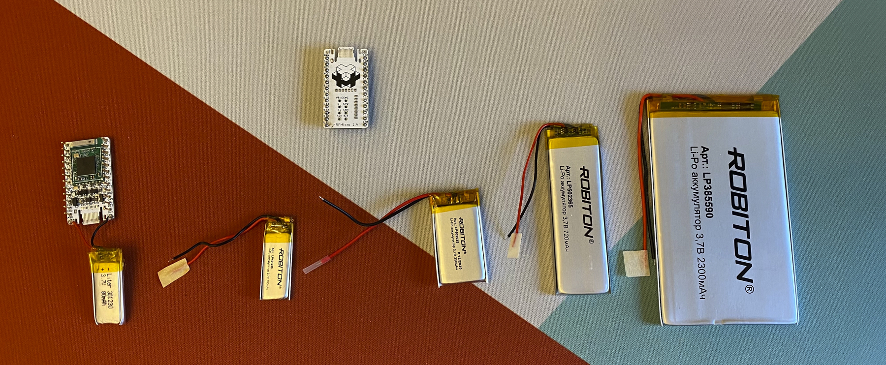

Usually, battery manufacturers always cheat a little with thickness. Here is the actual thickness of these batteries. 

The actual thickness between the bottom and the board in my keyboard about 6mm. The total thickness is one and a half centimeters. And the full height of the keyboard is 3 and a half. But there are the highest SA profile keycaps.

Left part of the keyboard will drain battery much faster than right part, because right part connects only to the left part, but left part connects to the right one and to the PC.

You can count everything from this link - https://zmk.dev/power-profiler/

For example, if you use the smallest 110mA battery in both halves of the keyboard, your keyboard will work about 6 days and 15 hours, if you do not use sleep. If you turn on sleep and your keyboard sleeps 70 percent of the time, you have two weeks and three days of battery life. We are talking about the left half of the keyboard. The right one lives about twice as long.

I chose 1200mA battery for the left half and 700mA for the right. And turn off sleep completely. I chose this one because I don't want to charge it always.

With this configuration, the calculator tells me that the charge in the left half is enough for me for 2 months and 4 days. On the right for 6 months and 3 days. We have not been able to verify this yet, since the batteries are still not discharged.

By weight, the keyboard is also pretty light. For example, my previous IRIS keyboard in a metal case weighs twice as much.

By the way, some people manage to insert AA or AAA batteries.

I bought these holders, but I don't understand how to place them on the keyboard. And the keyboard with these batteries does not look so good.

## Plug and switch

I also recommend to install some plug on the battery, in the furute you can quickly uninstall it without soldering. If you want to change the battery.

In addition, it is recommended to put a switch in order to break the circuit to turn off the keyboard completely if you do not plan to use it for some time. It is more difficult, because it is technically difficult to attach the switch somewhere.

## Charging and bluetooth

You should remember that the recharge rate here 100mA, so large batteries will take a long time to charge. For example, to fully charge my keyboard from 0 to 100 percent, I need to keep it on charge for 12 hours.

You can use the keyboard while it is charging. You can reconfigure the output of clicks. For example, you can connect the keyboard to the first computer via cable, and type on another computer via bluetooth. And then, with a keyboard shortcut, quickly switch and print on first computer.

Also, I recommend to buy magnet cable, using it, it will be much easier for you to put the keyboard on and off the charger.

## Backlight and display

I do not recommend to use LED backlighting and OLED display with a wireless keyboard, as they drain a lot of the battery. This is what happens to my battery life if I connect the backlight and screen.

|       | No LEDs, No OLED | LEDs, No OLED     | OLED, No LEDs   | LEDs and OLED     |
| :---- | ---------------- | ----------------- | --------------- | ----------------- |
| Left  | 2 months 4 days  | 1 hour 53 minutes | 1 week 12 hours | 1 hour 52 minutes |
| Right | 6 months 3 days  | 1 hour 6 minutes  | 4 days 19 hours | 1 hour 5 minutes  |

At the same time, if I understood correctly (you can correct me in the comments), even if you turn off the backlight in a software, the battery will still be drained. You need to unsolder the first LED in the chain and only after that your battery will not be drained.

## ZMK

To flash your keyboard, you need to generate two .uf2 files.

You need to install zmk software, create an empty repo in github, do not initialize anything and do not create a .README file, just create an empty repo.

Next, install ZMK and set a link to your repo. Mine, for example, is located at `https://github.com/devpew/zmk-config.git` But it is better to specify this address via ssh so that you do need to enter your password `git@github.com:devpew/zmk-config.git`

After that, ZMK will ask you what kind of keyboard you have, select crkbd and ask which controller you have. Choose nice!nano.

Now if you have nice!nano, then you don't need to do anything, but if you have nfrmicro, then go to the file `zmk-config/.github/workflows/build.yml` and change `nice!nano` to `nrfmicro_13`

You can see how I did it - https://github.com/devpew/zmk-config/blob/master/.github/workflows/build.yml

(You will most likely have an nrfmicro 1.4 controller, but you still need to set `nrfmicro_13` in the config)

After that, everything should work.

Now go to `zmk-config/blob/master/config/corne.keymap` file

This is your layout file. You can change something here and commit the changes.

After your commit you can go to the "Actions" tab, you will see that the top action is compiling. This usually takes about two minutes. When everything compiles it will turn green.

After that you can download your layout

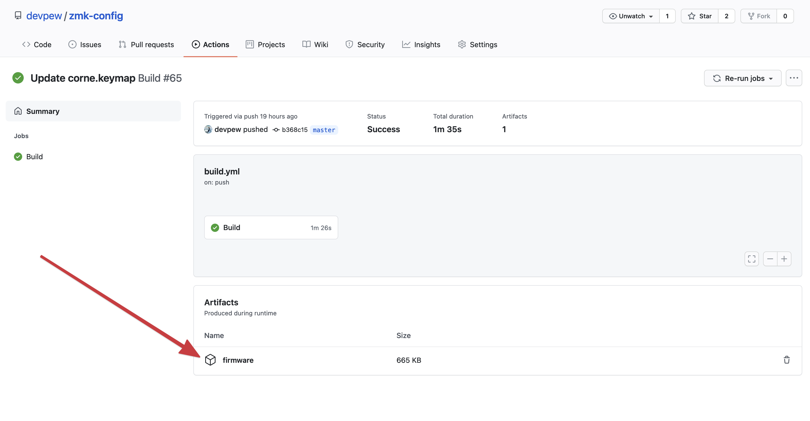

You will download the archive that you will need to unzip. In this archive you will find two files with firmware. For the left and right half of the keyboard.

Now connect the left half to your computer, and quickly press the reset button twice. A window will open, drag the file with the firmware for the left half into it. The file will be copied and the window will close. Disconnect, reconnect the right half and do the same.

After flashing, put the two halves side by side and press the reset buttons on them at the same time. After that, the right half should connect to the left.

If suddenly you have any problems, you can make a reset. This will completely reset the controller. You can download the file with the reset here - https://github.com/devpew/corne-wireless/tree/main/nrfmicro_13-settings_reset-zmk

Next, select a profile on the keyboard and connect to the computer.

In my firmware I put those buttons there. You can choose any bluetooth slot, for example the first one, if suddenly there is something on it, you can press btclt to clear it, after that on your computer you will see a new device "Corne" to which you can connect.

With macOS, I had a strange problem, I wanted to connect to the fifth slot. I spent half an hour on this, but I could not connect, keyboard was connected, but no keycodes were transmitted. At the same time, I connected to the first slot and keyboard start working without any problems.

On the second slot I have an iPhone connected, on the third I have an iPad. And I can switch between all the devices immediately.

## Is there QMK support?

No, there is no support, and as far as I understand this is due to some problems with the license.

## Is there support for VIA?

Unfortunately, no, there is no visual editor.

## Do I need to solder TRRS?

Not.

